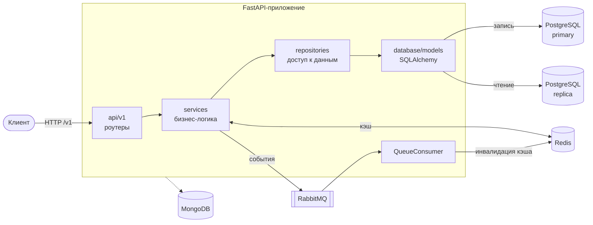

# SFMShop

[](https://github.com/DiMiRka/SFMShop/actions/workflows/ci-cd.yml)


---

## О проекте

REST API интернет-магазина. Проект показывает, как устроен асинхронный бэкенд на FastAPI со слоистой архитектурой,
кэшированием, очередью сообщений и тестами, которые не требуют поднятой инфраструктуры.

**Возможности**

- регистрация, вход и обновление токена (JWT access + refresh, OAuth2 password flow);
- CRUD товаров, пользователей и заказов, пагинация через `limit` / `offset`;
- разделение чтения и записи: отдельные сессии для primary и реплики PostgreSQL;
- кэш в Redis с инвалидацией по событиям из RabbitMQ;
- rate limiting на вход (slowapi), структурированные логи, Sentry подключается при наличии `sentry-sdk` и `SENTRY_DSN`;
- единый формат ошибок через доменные исключения и exception handlers.

## Стек

| Область        | Технологии                                             |
|----------------|--------------------------------------------------------|
| API            | FastAPI, Pydantic v2, Uvicorn                          |
| База данных    | PostgreSQL 17, SQLAlchemy 2 (async) + asyncpg, Alembic |
| Кэш            | Redis 7                                                |
| Очередь        | RabbitMQ 3 (aio-pika)                                  |
| Документы      | MongoDB 7 (Motor)                                      |
| Безопасность   | JWT (python-jose), argon2 (passlib), slowapi           |
| Инфраструктура | Docker, Docker Compose, Kubernetes, GitHub Actions     |
| Качество       | pytest, pytest-cov, ruff, mypy, Codecov                |

## Архитектура



Запрос проходит по слоям сверху вниз: роутер проверяет токен и валидирует вход, сервис применяет бизнес-правила и работает с кэшем,
репозиторий выполняет запросы к БД. Зависимости собираются через `Depends` в `src/core/dependencies.py`,
поэтому в тестах любой слой подменяется через `dependency_overrides`.

```
src/
├── api/v1/        # роутеры: auth, products, users, orders
├── services/      # бизнес-логика, кэш, продюсер и консьюмер RabbitMQ, логирование
├── repositories/  # запросы к БД поверх базового репозитория
├── database/      # модели SQLAlchemy, сессии primary/replica, клиент MongoDB
├── schemas/       # Pydantic-схемы запросов и ответов
├── models/        # доменные исключения, дескрипторы, миксины
├── core/          # настройки, безопасность (JWT, хэширование), DI, rate limiter
└── clients/       # HTTP-клиенты внешних сервисов
```

## Быстрый старт (Docker Compose)

Нужны Docker и Docker Compose. Команды выполняются из корня репозитория.

```bash
cp .env.example .env
```

```bash
docker compose -f docker/docker-compose.yml --env-file .env up --build
```

После первого запуска примените миграции:

```bash
docker compose -f docker/docker-compose.yml --env-file .env exec app alembic upgrade head
```

После этого доступны:

- Swagger UI: http://localhost:8000/docs
- ReDoc: http://localhost:8000/redoc
- RabbitMQ Management: http://localhost:15672 (guest / guest)

## Локальный запуск без Docker

Нужны Python 3.11+ и запущенные PostgreSQL, Redis, RabbitMQ и MongoDB (адреса берутся из `.env`).

```bash
python -m venv venv
```

Активируйте окружение: `venv\Scripts\activate` на Windows или `source venv/bin/activate` на Linux/macOS. Затем:

```bash
pip install -r requirements.txt
```

```bash
alembic upgrade head
```

```bash
uvicorn src.api.main:sfmshop_app --reload
```

## Эндпоинты

Все маршруты имеют префикс `/v1`. 🔒 означает, что нужен заголовок `Authorization: Bearer <access_token>`.
Полная схема запросов и ответов доступна в Swagger по адресу `/docs`.

**Аутентификация**

| Метод | Путь                 | Описание                                      |
|-------|----------------------|-----------------------------------------------|
| POST  | `/v1/auth/register`  | Регистрация пользователя                      |
| POST  | `/v1/auth/login`     | Вход, выдаёт access и refresh токены (с rate limit) |
| POST  | `/v1/auth/refresh`   | Новый access токен по refresh токену          |

**Товары**

| Метод  | Путь                      | Описание        |
|--------|---------------------------|-----------------|
| GET    | `/v1/products/`           | Список товаров  |
| GET    | `/v1/products/{id}`       | Товар по id     |
| POST   | `/v1/products/` 🔒        | Создать товар   |
| PUT    | `/v1/products/{id}` 🔒    | Обновить товар  |
| DELETE | `/v1/products/{id}` 🔒    | Удалить товар   |

**Пользователи**

| Метод  | Путь                        | Описание                  |
|--------|-----------------------------|---------------------------|
| GET    | `/v1/users/` 🔒             | Список пользователей      |
| GET    | `/v1/users/{id}` 🔒         | Пользователь по id        |
| PUT    | `/v1/users/{id}` 🔒         | Обновить пользователя     |
| DELETE | `/v1/users/{id}` 🔒         | Удалить пользователя      |
| GET    | `/v1/users/{id}/orders` 🔒  | Заказы пользователя       |

**Заказы**

| Метод  | Путь                    | Описание        |
|--------|-------------------------|-----------------|
| GET    | `/v1/orders/` 🔒        | Список заказов  |
| GET    | `/v1/orders/{id}` 🔒    | Заказ по id     |
| POST   | `/v1/orders/` 🔒        | Создать заказ   |
| DELETE | `/v1/orders/{id}` 🔒    | Удалить заказ   |

## Тесты

Тесты работают на моках и `dependency_overrides`, поэтому PostgreSQL, Redis и RabbitMQ для них не нужны.

```bash
pytest
```

С отчётом о покрытии:

```bash
pytest --cov=src --cov-report=term-missing
```

Линтер и проверка типов (то же, что в CI):

```bash
ruff check src/
```

```bash
mypy src/ --ignore-missing-imports
```

## CI/CD

Пайплайн `.github/workflows/ci-cd.yml` запускается на push и pull request:

1. **test**: ruff → mypy → pytest с покрытием → загрузка отчёта в Codecov;
2. **deploy** (только push в `master`): сборка образа, публикация в GitHub Container Registry, выкладка на сервер по SSH через `docker compose pull && up -d`.

## Конфигурация

Все настройки читаются из переменных окружения (`src/core/config.py`). Шаблон со всеми переменными лежит в [`.env.example`](.env.example).
Секреты в репозиторий не коммитятся.

## Документация

Проектные заметки и архитектурные решения лежат в [`docs/`](docs):

- [system_design.md](docs/system_design.md): общий дизайн системы
- [scalable_architecture.md](docs/scalable_architecture.md): масштабирование
- [message_queue_architecture.md](docs/message_queue_architecture.md): очереди сообщений
- [microservice_architecture.md](docs/microservice_architecture.md): выделение микросервисов
- [hosting_comparison.md](docs/hosting_comparison.md), [hosting_strategy.md](docs/hosting_strategy.md): выбор хостинга
- [k8s_deployment.md](k8s_deployment.md): развёртывание в Kubernetes
