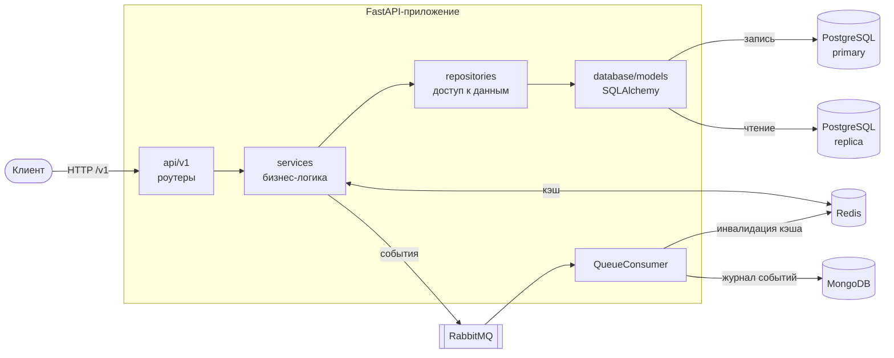

# SFMShop

[](https://github.com/DiMiRka/SFMShop/actions/workflows/ci-cd.yml)


---

## О проекте

REST API интернет-магазина \
Проект показывает, как устроен асинхронный бэкенд на FastAPI со слоистой архитектурой,
кэшированием, очередью сообщений и тестами, которые не требуют поднятой инфраструктуры

**Возможности**

- регистрация, вход и обновление токена (JWT access + refresh, OAuth2 password flow)
- CRUD товаров, пользователей и заказов, пагинация через `limit` / `offset`
- разделение чтения и записи: отдельные сессии для primary и реплики PostgreSQL
- кэш в Redis с инвалидацией по событиям из RabbitMQ
- rate limiting на вход и на ИИ-ассистента (slowapi, счётчики в Redis), структурированные логи, Sentry подключается при наличии `sentry-sdk` и `SENTRY_DSN`
- проверки здоровья `/health/live` и `/health/ready` для проб Kubernetes
- метрики Prometheus на отдельном порту 9100 и правила алертов
- единый формат ошибок через доменные исключения и exception handlers
- ИИ-ассистент магазина на Claude API: tool calling, structured output, права проверяет сервер, а не модель

## Стек

| Область        | Технологии                                             |
|----------------|--------------------------------------------------------|
| API            | FastAPI, Pydantic v2, Uvicorn                          |
| База данных    | PostgreSQL 17, SQLAlchemy 2 (async) + asyncpg, Alembic |
| Кэш            | Redis 7                                                |
| Очередь        | RabbitMQ 3 (aio-pika)                                  |
| Журнал событий | MongoDB 7 (асинхронный PyMongo)                        |
| Безопасность   | JWT (python-jose), argon2 (passlib), slowapi           |
| LLM            | Claude API (официальный SDK `anthropic`, async)        |
| Инфраструктура | Docker, Docker Compose, Kubernetes, GitHub Actions     |
| Качество       | pytest, pytest-cov, ruff, mypy, Codecov                |
| Мониторинг     | Prometheus (prometheus_client), Grafana, Sentry        |

## Архитектура


```mermaid
flowchart LR
    Client([Клиент]) -->|HTTP /v1| API

    subgraph App["FastAPI-приложение"]
        API["api/v1<br/>роутеры"] --> Services["services<br/>бизнес-логика"]
        Services --> Repos["repositories<br/>доступ к данным"]
        Repos --> Models["database/models<br/>SQLAlchemy"]
        Consumer["QueueConsumer"]
    end

    Models -->|запись| PGW[(PostgreSQL<br/>primary)]
    Models -->|чтение| PGR[(PostgreSQL<br/>replica)]
    Services <-->|кэш| Redis[(Redis)]
    Services -->|события| MQ[[RabbitMQ]]
    MQ --> Consumer
    Consumer -->|инвалидация кэша| Redis
    Consumer -->|журнал событий| Mongo[(MongoDB)]
```

Запрос проходит по слоям сверху вниз: роутер проверяет токен и валидирует вход, сервис применяет бизнес-правила и работает с кэшем,
репозиторий выполняет запросы к БД. Зависимости собираются через `Depends` в `src/core/dependencies.py`,
поэтому в тестах любой слой подменяется через `dependency_overrides`

```
src/
├── api/v1/        # роутеры: auth, products, users, orders, assistant
├── services/      # бизнес-логика, кэш, продюсер и консьюмер RabbitMQ, логирование, ИИ-ассистент
├── repositories/  # запросы к БД поверх базового репозитория
├── database/      # модели SQLAlchemy, сессии primary/replica, клиент MongoDB
├── schemas/       # Pydantic-схемы запросов и ответов
├── models/        # доменные исключения, дескрипторы, миксины
├── core/          # настройки, безопасность (JWT, хэширование), DI, rate limiter
└── clients/       # клиенты внешних сервисов, в том числе LLM (clients/llm)
```

## Быстрый старт (Docker Compose)

Нужны Docker и Docker Compose, команды выполняются из корня репозитория

```bash
cp .env.example .env
```

```bash
docker compose -f deploy/docker/docker-compose.yml --env-file .env up --build
```

После первого запуска примените миграции:

```bash
docker compose -f deploy/docker/docker-compose.yml --env-file .env exec app alembic upgrade head
```

После этого доступны:

- Swagger UI: http://localhost:8000/docs
- ReDoc: http://localhost:8000/redoc
- RabbitMQ Management: http://localhost:15672 (guest / guest)
- Метрики приложения: http://localhost:9100/metrics
- Prometheus с правилами алертов: http://localhost:9090
- Grafana с дашбордом «Состояние сервиса»: http://localhost:3001 (просмотр без входа; для правки вход `admin` / `GRAFANA_ADMIN_PASSWORD`, по умолчанию `admin`)\
  Дашборд хранится в `deploy/grafana/dashboards/sfmshop-service.json` (после правки файла выполните `docker compose ... restart grafana`)

Чтобы получить администратора, зарегистрируйте пользователя через `/v1/auth/register` и выдайте ему права:

```bash
docker compose -f deploy/docker/docker-compose.yml --env-file .env exec app python -m scripts.make_admin admin@example.com
```

## Локальный запуск без Docker

Нужны Python 3.11+ и запущенные PostgreSQL, Redis, RabbitMQ и MongoDB (адреса берутся из `.env`).

```bash
python -m venv venv
```

Активируйте окружение: `venv\Scripts\activate` на Windows или `source venv/bin/activate` на Linux/macOS \
Затем:

```bash
pip install -r requirements.txt
```

```bash
alembic upgrade head
```

```bash
uvicorn src.api.main:sfmshop_app --reload
```

Для отладки можно выставить `DEBUG=True` в `.env`: при необработанной ошибке в ответе будет полный traceback \
Только для локальной разработки, на сервере `DEBUG` должен оставаться `False`

## Роли и права доступа

Есть две роли: обычный пользователь и администратор (`is_admin` в таблице `users`)

- **Пользователь** работает только со своими данными: видит и удаляет свои заказы, читает, меняет и удаляет свой профиль. \
  Чужой заказ для него не существует (404), обращение к чужому профилю даёт 403
- **Администратор** имеет полный доступ: управляет каталогом товаров, видит всех пользователей и все заказы,
  меняет баланс, активность и права любого пользователя
- Поля `balance`, `is_active` и `is_admin` меняет только администратор. \
  При регистрации баланс всегда 0, а права администратора через API получить нельзя
- Свой пароль меняется только с указанием текущего (`current_password`), в том числе для администратора. \
  Администратор может задать новый пароль другому пользователю без его текущего пароля

Первого администратора назначает CLI-скрипт (пользователь должен быть уже зарегистрирован):

```bash
python -m scripts.make_admin admin@example.com
```

Отозвать права можно флагом `--revoke`. \
Дальше администратор может выдавать права другим через `PUT /v1/users/{id}`

## Эндпоинты

Все маршруты имеют префикс `/v1` \
🔒 означает, что нужна авторизация (заголовок `Authorization: Bearer <access_token>`) \
👑 означает, что эндпоинт доступен только администратору \
Полная схема запросов и ответов доступна в Swagger по адресу `/docs`

**Аутентификация**

| Метод | Путь                 | Описание                                      |
|-------|----------------------|-----------------------------------------------|
| POST  | `/v1/auth/register`  | Регистрация пользователя                      |
| POST  | `/v1/auth/login`     | Вход, выдаёт access и refresh токены (с rate limit) |
| POST  | `/v1/auth/refresh`   | Новый access токен по refresh токену          |

**Товары**

| Метод  | Путь                      | Описание        |
|--------|---------------------------|-----------------|
| GET    | `/v1/products/`           | Список товаров  |
| GET    | `/v1/products/{id}`       | Товар по id, со средним рейтингом и числом отзывов |
| POST   | `/v1/products/` 👑        | Создать товар   |
| PUT    | `/v1/products/{id}` 👑    | Обновить товар  |
| DELETE | `/v1/products/{id}` 👑    | Удалить товар   |

**Отзывы**

| Метод  | Путь                              | Описание                                                        |
|--------|-----------------------------------|-----------------------------------------------------------------|
| GET    | `/v1/products/{id}/reviews`       | Отзывы о товаре, новые первыми, со средним рейтингом            |
| POST   | `/v1/products/{id}/reviews` 🔒    | Оставить отзыв (оценка 1–5): только на купленный товар, один на товар |
| PATCH  | `/v1/reviews/{id}` 🔒             | Изменить свой отзыв                                             |
| DELETE | `/v1/reviews/{id}` 🔒             | Удалить отзыв: свой или любой для админа                        |

**Пользователи**

| Метод  | Путь                        | Описание                                                                                                                         |
|--------|-----------------------------|----------------------------------------------------------------------------------------------------------------------------------|
| GET    | `/v1/users/` 👑             | Список пользователей                                                                                                             |
| GET    | `/v1/users/{id}` 🔒         | Профиль: только свой или любой для админа                                                                                        |
| PUT    | `/v1/users/{id}` 🔒         | Обновить профиль <br/>`balance`, `is_active`, `is_admin` меняет только админ<br/> Смена своего пароля требует `current_password` |
| DELETE | `/v1/users/{id}` 🔒         | Удалить профиль: только свой или любой для админа                                                                                |
| GET    | `/v1/users/{id}/orders` 🔒  | Заказы пользователя: только свои или любые для админа                                                                            |

**Заказы**

| Метод  | Путь                    | Описание                                      |
|--------|-------------------------|-----------------------------------------------|
| GET    | `/v1/orders/` 🔒        | Только свои заказы (админ видит все)          |
| GET    | `/v1/orders/{id}` 🔒    | Заказ по id: только свой или любой для админа |
| POST   | `/v1/orders/` 🔒        | Создать заказ от имени текущего пользователя  |
| DELETE | `/v1/orders/{id}` 🔒    | Удалить заказ (деньги возвращаются владельцу) |

**ИИ-ассистент**

| Метод | Путь                | Описание                                                        |
|-------|---------------------|-----------------------------------------------------------------|
| POST  | `/v1/assistant` 🔒  | Вопрос о товарах и своих заказах текстом (с rate limit)         |

**Журнал событий**

| Метод | Путь              | Описание                                                                                  |
|-------|-------------------|-------------------------------------------------------------------------------------------|
| GET   | `/v1/events/` 👑  | События из MongoDB, новые первыми; фильтры `event`, `user_id`, `order_id`, `product_id`, пагинация через `before` |

**Служебные** (без префикса `/v1` и без токена)

| Метод | Путь            | Описание                                                                                      |
|-------|-----------------|-----------------------------------------------------------------------------------------------|
| GET   | `/health/live`  | Процесс жив, внешние сервисы не проверяются                                                   |
| GET   | `/health/ready` | PostgreSQL и реплика доступны (иначе 503)<br/>Redis, RabbitMQ, MongoDB или консьюмер очереди недоступны →  статус `degraded` |

Метрики Prometheus отдаются не на порту API, а на отдельном порту `METRICS_PORT` (по умолчанию 9100): `GET :9100/metrics`

## ИИ-ассистент

Пользователь пишет вопрос текстом, модель Claude вызывает инструменты, сервер выполняет их и возвращает модели результат \
Цикл повторяется пока модель не даст финальный ответ \
Ответ клиенту приходит строго по Pydantic-схеме

```http
POST /v1/assistant
Authorization: Bearer <access_token>

{"message": "найди клавиатуры до 5000 в наличии"}
```

```json
{
  "answer": "Нашёл две клавиатуры в наличии: Logitech K120 за 1490 ₽ и Keychron K2 за 4790 ₽.",
  "product_ids": [12, 31],
  "order_ids": []
}
```

**Инструменты**

| Инструмент        | Что делает                                                             |
|-------------------|------------------------------------------------------------------------|
| `search_products` | поиск по подстроке в названии, диапазону цены и наличию, до 20 товаров |
| `get_product`     | товар по id                                                            |
| `list_my_orders`  | последние заказы текущего пользователя, новые первыми                  |
| `get_my_order`    | заказ по id (чужой заказ даст результат «не найден»)                   |

**Ограничения и защита**

- **Только чтение** \
  Инструментов, которые создают или меняют заказы и товары, нет. \
  Это сознательное решение:
  ошибка модели или prompt injection не могут привести к списанию денег
- **Права проверяет сервер** \
  Инструменты вызывают те же сервисы с теми же проверками, что и REST API
  (`order_owner_filter`).\
  Чужой заказ модель не увидит, даже если пользователь попросит или представится администратором
- **Аргументы инструментов** \
  Описаны Pydantic-моделями: из них строится JSON-схема для модели, ими же проверяются
  аргументы, которые прислала модель. \
  Ошибка возвращается модели как результат инструмента, а не как 500
- **Выдуманные id отбрасываются** \
  В ответе остаются только `product_ids` и `order_ids`, которые вернули инструменты в этом запросе
- **Лимиты** \
  Не больше `LLM_MAX_TOOL_STEPS` шагов, сообщение до 1000 символов, `max_tokens` из настроек,
  rate limit `RATE_LIMIT_ASSISTANT` на каждого пользователя
- **Устойчивость** \
  Таймаут и повторы с экспоненциальной задержкой на 429, 5xx и сетевые ошибки. \
  Если провайдер недоступен или `ANTHROPIC_API_KEY` не задан, эндпоинт отвечает 503, остальное приложение работает
- **Каждый запрос независим:** история диалога не хранится

Провайдер LLM спрятан за интерфейсом `LLMClient` (`Protocol`) и выбирается настройкой `LLM_PROVIDER` \
Сейчас реализован один провайдер Anthropic \
Более подробно по решениям описаны в [docs/llm_assistant.md](docs/llm_assistant.md)

## Тесты

Тесты работают на моках и `dependency_overrides`, поэтому PostgreSQL, Redis и RabbitMQ для них не нужны \
Ассистент тестируется на фейковом LLM-клиенте (ключ API и сеть не требуются)

```bash
pytest
```

С отчётом о покрытии:

```bash
pytest --cov=src --cov-report=term-missing
```

Интеграционные тесты (`tests/integration`) запускают приложение целиком с настоящими PostgreSQL, Redis, RabbitMQ и MongoDB \
Без переменной `RUN_INTEGRATION_TESTS=1` они пропускаются, в CI идут отдельной задачей \
Для локального запуска задайте `RUN_INTEGRATION_TESTS=1` и переменные подключения (`DB_*`, `DB_REPLICA_*`, `REDIS_*`, `RABBITMQ_URL`, `MONGO_URL`)
к отдельным сервисам и примените миграции (не запускайте их против рабочей базы, тесты создают пользователей, товары и заказы)

Линтер и проверка типов (то же, что в CI):

```bash
ruff check src/ tests/
```

```bash
mypy src/ --ignore-missing-imports
```

## CI/CD

Пайплайн `.github/workflows/ci-cd.yml` запускается на push и pull request:

1. **test**: ruff → mypy → миграции на PostgreSQL (`upgrade head`, `alembic check`, `downgrade base`, снова `upgrade head`) → pytest с покрытием и проверкой схемы после миграций → загрузка отчёта в Codecov
2. **build** (параллельно с test, на каждый push и pull request): сборка Docker-образа → `pip check` и импорт приложения внутри образа. Слои сохраняются в кэш GitHub Actions
3. **integration** (параллельно): PostgreSQL, Redis, RabbitMQ и MongoDB в сервис-контейнерах → миграции → интеграционные тесты `tests/integration`, приложение стартует целиком через lifespan
4. **deploy** (только push в `master`, после успешных test, build и integration): сборка образа из кэша, публикация в GitHub Container Registry, выкладка на сервер по SSH через `docker compose pull && up -d`

## Конфигурация

Все настройки читаются из переменных окружения (`src/core/config.py`) \
Шаблон со всеми переменными лежит в [`.env.example`](.env.example) \
Секреты в репозиторий не коммитятся.

## Документация

Проектные заметки и архитектурные решения лежат в [`docs/`](docs):

- [system_design.md](docs/system_design.md): общий дизайн системы
- [framework_choice.md](docs/framework_choice.md): почему FastAPI, а не Django
- [database.md](docs/database.md): PostgreSQL, Redis и MongoDB (журнал событий), репликация и шардирование
- [llm_assistant.md](docs/llm_assistant.md): ИИ-ассистент, tool calling и защита от prompt injection
- [scalable_architecture.md](docs/scalable_architecture.md): масштабирование
- [message_queue_architecture.md](docs/message_queue_architecture.md): очереди сообщений
- [microservice_architecture.md](docs/microservice_architecture.md): выделение микросервисов
- [hosting_comparison.md](docs/hosting_comparison.md), [hosting_strategy.md](docs/hosting_strategy.md): выбор хостинга
- [deploy/docker](deploy/docker): Dockerfile и Docker Compose для локального запуска
- [deploy/k8s](deploy/k8s): манифесты и инструкция по развёртыванию в Kubernetes
